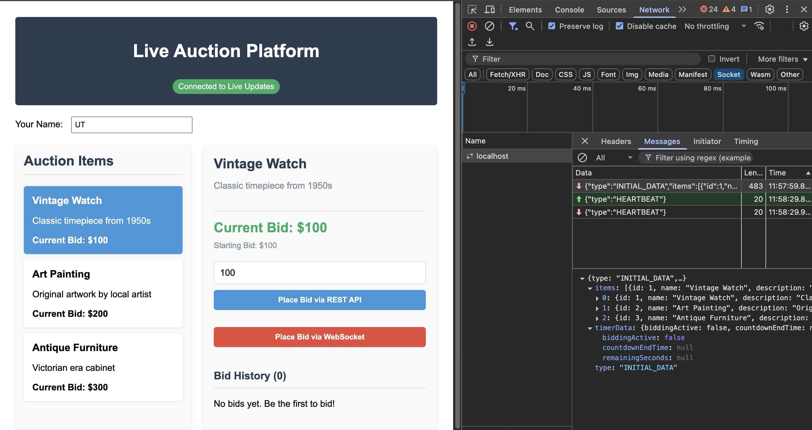
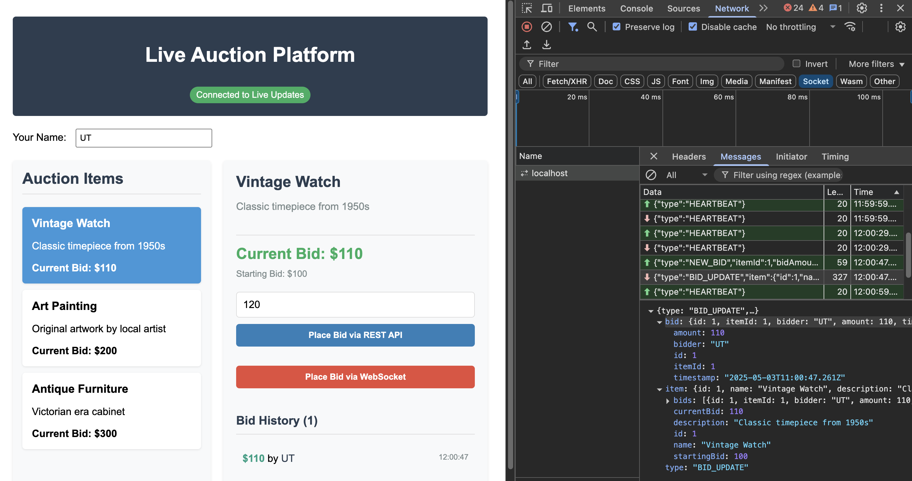
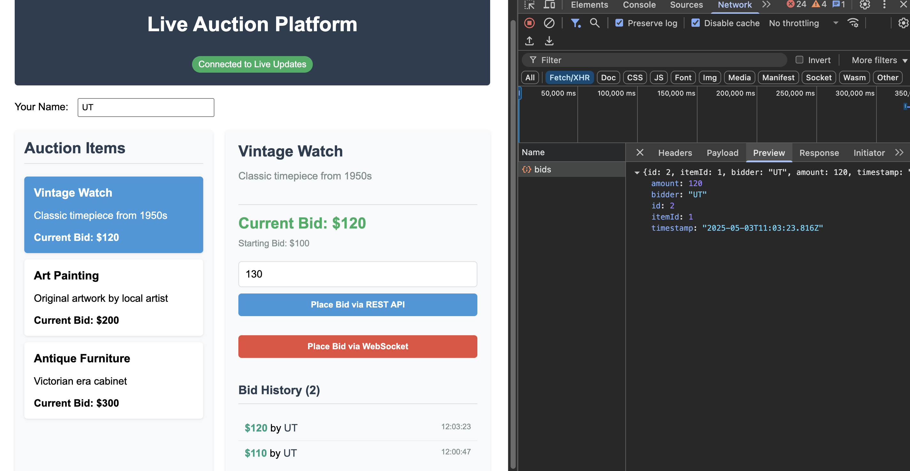
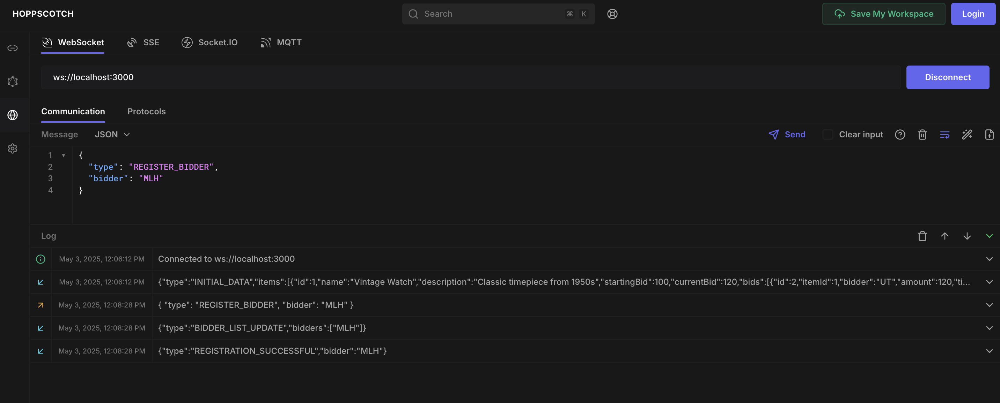

# Websockets Auction Platform

A simple live auction platform demonstrating the difference between traditional REST API interactions and real-time updates using WebSockets. Users can view auction items, place bids, and see updates instantly without needing to refresh the page.

## Features

### User Features

* **View Auction Items:** Browse a list of items available for auction.
* **View Item Details:** Select an item to see its description, starting bid, current highest bid, and bid history.
* **Place Bids:**
  * **REST API Bidding:** Submit bids via a traditional HTTP POST request.
  * **WebSocket Bidding:** Submit bids via a WebSocket message for faster processing and real-time feedback.
* **Real-time Updates:** Automatically see the latest bids and current prices updated live via WebSockets.
* **Connection Status:** Visual indicator showing whether the real-time WebSocket connection is active or attempting to reconnect.
* **Set Bidder Name:** Users can set their name, which is associated with their bids.

### Backend & Real-time Features

* **Hybrid API:** Provides both a REST API for standard operations and a WebSocket server for real-time communication.
* **Persistent Storage:** Uses SQLite to store auction items and bid history.
* **Bid Validation:** Ensures bids are higher than the current highest bid.
* **Broadcasting:** New bids (placed via REST or WebSocket) are broadcast to all connected clients in real-time.
* **WebSocket Management:** Handles client connections, disconnections, heartbeats (keep-alive), and automatic reconnection attempts on the client-side.
* **Initial Data Sync:** Sends the current state of all auction items to clients upon WebSocket connection.

### Admin Features (Backend Only - UI Pending)

* **Authentication:** Simple username/password authentication for admin actions (configured via `.env`).
* **Bid Acceptance:** Endpoint to mark a specific bid as accepted (broadcasts event).
* **Auction Timer:** Endpoints to start and stop a countdown timer for bidding (broadcasts timer state).
* **Bidder Management:** Endpoints to view connected bidders and remove/kick a specific bidder.

## Technology Stack

* **Backend:** Node.js, Express.js, `ws` (WebSocket library), SQLite, dotenv
* **Frontend:** React, TypeScript, Vite, `styled-components`, Axios

## Prerequisites

* Node.js (v20 or later) - REQUIRED
* npm (v10 or later) - REQUIRED

## Running Locally

1. **Fork & Clone:**
    * **Fork** the repository to your GitHub account.
    * Clone YOUR forked repository to your local machine:

        ```bash
        git clone https://github.com/YOUR_USERNAME/websockets-auction-platform.git
        cd websockets-auction-platform
        ```

2. **Backend Setup:**
    * Navigate to the backend directory:

        ```bash
        cd backend
        ```

    * Install dependencies:

        ```bash
        npm install
        ```

    * **Create Environment File:** Create a `.env` file in the `backend` directory with the following content (adjust credentials as needed):

        ```dotenv
        # .env file for backend configuration
        ADMIN_USERNAME=admin
        ADMIN_PASSWORD=admin123
        PORT=3000
        ```

    * **Run the Backend Server:** This command starts the server using `nodemon` for automatic restarts on file changes. It runs both the Express REST API and the WebSocket server.

        ```bash
        npm run dev
        ```

        The backend server will typically run on `http://localhost:3000`. The database file (`data/auction.db`) will be created automatically if it doesn't exist.

3. **Frontend Setup:**
    * Open a **new terminal window/tab**.
    * Navigate to the frontend directory:

        ```bash
        cd frontend # Make sure you are in the root project directory first
        ```

    * Install dependencies:

        ```bash
        npm install
        ```

    * **Run the Frontend Development Server:**

        ```bash
        npm run dev
        ```

        The frontend development server (Vite) will start, usually on `http://localhost:5173` (check the terminal output for the exact URL).

4. **Access the Application:**
    * Open your web browser and navigate to the frontend URL provided in the terminal (e.g., `http://localhost:5173`).

You should now see the Live Auction Platform running, connecting to the backend, and displaying auction items. You can place bids using either the REST or WebSocket buttons.

## NOTE: The bidder name must NOT be "Anonymous" or empty. If you do that, you can't place a bid

## Debugging & Testing

* **Backend Debugging:** Use the terminal output to see logs for incoming requests, WebSocket connections, and errors.
* **Frontend Debugging:** Use the browser's developer tools (F12) to inspect network requests, console logs, and WebSocket connections. You can find the WebSocket connection in the "Network" tab under "WS" / "Socket" (WebSocket) filter.

## Usage

### To test the backend API

* Use [Hoppscotch](https://hoppscotch.io/) to send requests to the REST API endpoints and WebSocket server.
* The REST API is available at `http://localhost:3000/api/`.
* The WebSocket server is available at `ws://localhost:3000/`.
* List of available REST endpoints:
  * `GET /api/items` - Get all auction items
  * `GET /api/items/:id` - Get a specific auction item by ID
  * `POST /api/bids` - Place a bid on an auction item (REST)
  * `GET /api/history` - Get bid history for an auction item
  * `GET /api/admin/login` - Admin login (requires admin username and password)
  * `POST /api/admin/accept-bid` - Accept a specific bid (admin only)
  * `POST /api/admin/timer/start` - Start the auction timer (admin only)
  * `POST /api/admin/timer/stop` - Stop the auction timer (admin only)
  * `GET /api/admin/bidders` - Get a list of connected bidders (admin only)
  * `POST /api/admin/remove-bidder` - Kick a specific bidder (admin only)
  * `GET /api/timer r` - Get the current auction timer state

* List of available WebSocket events:
  * `INITIAL_DATA` - Sent when a client connects to the WebSocket server, containing the current state of all auction items.
  * `HEARTBEAT` - Sent periodically to keep the connection alive.
  * `REGISTER_BIDDER` - Sent when a new bidder connects, containing their name.
  * `REGISTRATION_SUCCESSFUL` - Sent when a bidder successfully registers, containing their name.
  * `BIDDER_LIST_UPDATE` - Sent when the list of connected bidders is updated, containing the list of current bidders.
  * `ERROR` - Sent when an error occurs, containing the error message.
  * `NEW_BID` - Sent when a new bid is placed, containing the auction item, bid amount, and bidder name.
  * `BID_UPDATE` - Sent when a bid is updated, containing the auction item and updated bid details.
  * `BID_ACCEPTED` - Sent when a bid is accepted by the admin, containing the auction item ID and accepted bid details.
  * `REMOVED_BY_ADMIN` - Sent when a bidder is removed by the admin, containing the bidder's name.
  * `TIMER_UPDATE` - Sent when the auction timer is updated.

### To test the frontend

* Open the frontend application in your web browser (e.g., `http://localhost:5173`). Use multiple browsers or incognito windows to simulate multiple bidders.
* You can view the auction items, place bids, and see real-time updates.

## Screenshots








